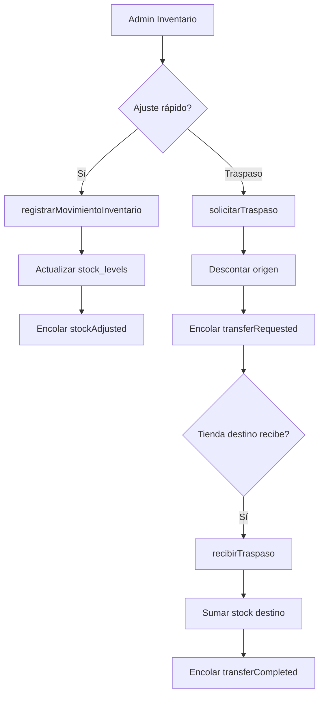

# POSIA v6.1 — Especificación de implementación

**Autor:** Equipo POSIA  
**Matricula:** POSIA-2026-001  
**Fecha:** 2026-06-12  
**Estado:** Implementada — v6.1 completada 2026-06-12  
**Prerequisito:** v6.0 completada ([PENDIENTES_V6.md](PENDIENTES_V6.md))

---

## Objetivo

Completar las áreas operativas que quedaron parciales en v6.0: **productos robustos**, **inventario funcional**, y **fichas enriquecidas** de clientes y proveedores. Esta fase eleva la madurez estimada de **72 → 88 / 100**.

---

## Resumen de entregables

| Módulo | Pantallas / capa | Prioridad | Esfuerzo est. |
|--------|------------------|-----------|---------------|
| Productos | `PantallaProductosAdmin`, `ServicioAdmin`, schema | P0 | 3–4 días |
| Inventario | Existencias, movimientos, traspasos | P0 | 2–3 días |
| Clientes | Ficha + historial ventas | P1 | 1–2 días |
| Proveedores | Ficha + relación productos | P1 | 1–2 días |
| Búsqueda restante | Inventario, movimientos, traspasos, reportes | P2 | 0.5 día |
| Tests E2E admin | `posia_database_test`, widget tests | P1 | 1 día |

---

## 1. Productos — alta robusta

### 1.1 Problema actual

| Limitación | Ubicación |
|------------|-----------|
| Alta solo pide nombre, código y un precio | `pantalla_productos_admin.dart` → `registrarProducto` |
| Categoría se asigna después, no en el alta | `_asignarCategoria` al tocar fila |
| No hay edición ni eliminación | UI ausente |
| Mayoreo existe en DB pero no en UI | `PrecioRepository.guardarEscalaMayoreo`, tabla `wholesale_tiers` |
| Carnicería/farmacia dependen de `ModuloVertical` | Campo en `Producto`, no de categoría |
| `piezasPorCaja` existe en modelo pero no se captura | `Producto.piezasPorCaja` |

### 1.2 Modelo de datos objetivo

Sin migración de schema en v6.1 — reutilizar tablas existentes:

```
products
├── categoria_id          (obligatorio en UI)
├── unidad_medida         (pieza | kilogramo | litro | ...)
├── modulo_vertical       (derivado de categoría o selector explícito)
├── piezas_por_caja       (nullable; ej. 12)
└── precio_base

wholesale_tiers           (0..N por producto)
├── cantidad_minima
└── precio_unitario

product_variants          (ya existe — presentaciones)
price_list_items          (precio por lista de precios)
customer_product_prices   (precio especial por cliente)
```

**Nuevo campo propuesto (migración v5 → v6.1, opcional):**

```sql
ALTER TABLE products ADD COLUMN proveedor_id TEXT;
ALTER TABLE products ADD COLUMN unidades_por_bulto INTEGER;
ALTER TABLE products ADD COLUMN notas TEXT;
```

Tabla puente alternativa si un producto tiene varios proveedores (v7):

```sql
CREATE TABLE product_suppliers (
  producto_id TEXT NOT NULL,
  proveedor_id TEXT NOT NULL,
  costo_unitario REAL,
  PRIMARY KEY (producto_id, proveedor_id)
);
```

### 1.3 UI — formulario unificado

Reemplazar diálogo simple por **`PantallaFormularioProducto`** (ruta full-screen o modal grande) con pestañas:

#### Pestaña General

| Campo | Tipo | Validación |
|-------|------|------------|
| Nombre | Texto | Obligatorio, max 120 chars |
| Código de barras | Texto | Único en catálogo activo |
| Categoría | Dropdown | **Obligatorio** — lista de `Categoria` activas |
| Unidad de venta | Enum `UnidadMedida` | Default `pieza` |
| Módulo vertical | Auto | Si categoría = Carnicería → `carniceria`; Farmacia → `farmacia`; resto → `general` |
| Activo | Switch | Default true |
| Imagen | Opcional | Ruta local (futuro: picker) |

#### Pestaña Precios

| Bloque | Descripción |
|--------|-------------|
| Precio menudeo | `precioBase` — precio unitario estándar |
| Escalas mayoreo | Lista editable: cantidad mínima + precio unitario |
| Precio por peso | Visible si `unidadMedida == kilogramo` — precio por kg |
| Listas de precios | Selector lista + precio (usa `price_list_items`) |

Reglas de negocio en caja (ya en `posia_pricing`):

1. Precio cliente-producto (`customer_product_prices`)
2. Precio lista del cliente (`price_list_items`)
3. Escala mayoreo por cantidad (`wholesale_tiers`)
4. `precioBase`

#### Pestaña Empaque y conversión

| Campo | Ejemplo | Uso en caja |
|-------|---------|-------------|
| Piezas por caja | 12 | Comando voz / selector "1 caja" = 12 uds |
| Unidades por bulto | 144 | "1 bulto" = 144 uds (nuevo campo o reutilizar lógica) |
| Unidad base | pieza | Stock se descuenta en unidad base |

Conversión en venta:

```
cantidad_venta = cantidad_capturada × factor_conversion
factor_conversion = piezasPorCaja | unidadesPorBulto | 1
```

#### Pestaña Inventario (solo edición)

| Campo | Descripción |
|-------|-------------|
| Stock inicial | Solo en alta; escribe `stock_levels` tienda activa |
| Stock mínimo | `stock_minimo` en `stock_levels` |
| Enlace | Botón "Ver movimientos" → filtra por `productoId` |

### 1.4 API de servicio (`ServicioAdmin`)

Nuevos / ampliados métodos:

```dart
Future<Producto> registrarProductoCompleto(AltaProductoRequest req);
Future<Producto> actualizarProducto(Producto producto);
Future<void> eliminarProducto(String productoId); // soft: activo=false; hard si stock=0
Future<void> guardarEscalasMayoreo(String productoId, List<EscalaMayoreo> escalas);
Future<List<EscalaMayoreo>> listarEscalasMayoreo(String productoId);
```

`AltaProductoRequest` — DTO con todos los campos de las pestañas.

Validaciones en `eliminarProducto`:

- Si `stock > 0` en cualquier tienda → rechazar con mensaje
- Si tiene ventas en últimos 30 días → soft delete (`activo = false`)
- Si stock = 0 y sin ventas recientes → permitir eliminación física

### 1.5 Listado de productos (mejora UI)

- Tarjeta por producto: icono categoría, nombre, precio, stock tienda activa
- Acciones: Editar | Variantes | Eliminar
- Filtro por categoría (chip horizontal, reutilizar `BarraCategorias`)
- Búsqueda ya implementada en v6.0

### 1.6 Consolidación carnicería / farmacia

| Antes (v5) | Después (v6.1) |
|------------|----------------|
| Admin → Carnicería | Admin → Productos → filtro categoría "Carnicería" |
| Admin → Farmacia | Admin → Productos → filtro categoría "Farmacia" |
| `ModuloVertical` manual | Derivado de categoría en formulario |
| Lotes farmacia | Pestaña "Lotes" visible si vertical = farmacia |

Archivos legacy **eliminados** (consolidados en Productos + caja):

- ~~`pantalla_carniceria_admin.dart`~~
- ~~`pantalla_farmacia_admin.dart`~~

---

## 2. Inventario — existencias, movimientos, traspasos

### 2.1 Diagnóstico de fallos actuales

| Síntoma | Causa probable |
|---------|----------------|
| Ajuste no reflejado en caja | Provider no invalidado / stock por variante vs producto padre |
| Movimiento "ajuste" suma en lugar de fijar | `registrarMovimientoInventario`: tipo `ajuste` usa misma lógica que `entrada` |
| Traspaso muestra IDs crudos | UI usa `tiendaOrigenId` sin resolver nombre |
| No se puede recibir traspaso | Tienda activa ≠ destino, o sync no aplicó evento |
| Sin feedback de error | Excepciones no capturadas en UI |

### 2.2 Existencias (`PantallaInventarioAdmin`)

**Mejoras UI:**

```
┌─────────────────────────────────────────┐
│ [Buscar producto...]                    │
│ Filtro: [Todas tiendas ▼] [Solo bajo mínimo] │
├─────────────────────────────────────────┤
│ 🟢 Arroz 1kg    Centro: 45  Norte: 12   │
│    [+ Entrada] [- Salida] [Ajustar]     │
│ 🔴 Leche 1L     Centro: 2   min: 10     │
└─────────────────────────────────────────┘
```

Funcionalidad:

- [ ] `CampoBusqueda` por nombre producto
- [ ] Agrupar por producto con columnas por tienda (pivot simple)
- [ ] Badge rojo si `cantidad < stockMinimo`
- [ ] Acciones rápidas → abren sheet con cantidad + motivo → `registrarMovimientoInventario`
- [ ] Tipo `ajuste`: establecer cantidad absoluta, no delta

**Fix backend — tipo ajuste:**

```dart
// registrarMovimientoInventario
final nuevo = switch (tipo) {
  TipoMovimientoInventario.entrada => anterior + cantidad,
  TipoMovimientoInventario.salida => anterior - cantidad,
  TipoMovimientoInventario.ajuste => cantidad, // cantidad = valor final deseado
};
final delta = nuevo - anterior;
```

### 2.3 Movimientos (`PantallaMovimientosInventario`)

**Mejoras UI:**

- Historial arriba con filtros: tipo, producto, rango de fechas
- Formulario abajo en `ExpansionTile` "Registrar movimiento"
- Mostrar nombre producto (resolver ID → nombre)
- SnackBar éxito/error
- Invalidar `_inventarioConsolidadoProvider` tras guardar

**Columnas del listado:**

| Columna | Fuente |
|---------|--------|
| Fecha | `MovimientoInventario.creadoEn` |
| Producto | Resolver `productoId` |
| Tipo | entrada / salida / ajuste |
| Cantidad | `cantidad` |
| Antes → Después | `cantidadAnterior` → `cantidadNueva` |
| Motivo | `motivo` |

### 2.4 Traspasos (`PantallaTraspasosAdmin`)

**Flujo guiado en 3 pasos:**

```
Paso 1: Origen (tienda activa, solo lectura)
Paso 2: Destino (dropdown tiendas ≠ origen)
Paso 3: Producto + cantidad + notas
        → [Solicitar traspaso]
```

**Listado mejorado:**

| Estado | Acción disponible |
|--------|-------------------|
| `enTransito` + destino = tienda activa | Botón **Recibir** |
| `enTransito` + origen = tienda activa | Solo lectura + cancelar (v6.2) |
| `completado` | Badge verde, sin acciones |

Mostrar **nombres** de tienda (`TiendaRepository.obtenerPorId`), no UUIDs.

**Validaciones:**

- Stock origen ≥ cantidad solicitada (ya en `solicitarTraspaso`)
- No traspasar a la misma tienda
- Cantidad > 0

**Sync:** eventos `transferRequested` / `transferCompleted` ya en `AplicadorEventosSqlite` — verificar que tienda destino reciba en cola.

### 2.5 Diagrama de flujo inventario



---

## 3. Clientes — ficha enriquecida

### 3.1 Modelo actual vs objetivo

**Actual** (`Cliente`):

- `id`, `nombre`, `listaPreciosId`, `creditoHabilitado`, `activo`

**Objetivo v6.1** — migración schema v6.1:

```sql
ALTER TABLE customers ADD COLUMN telefono TEXT DEFAULT '';
ALTER TABLE customers ADD COLUMN email TEXT DEFAULT '';
ALTER TABLE customers ADD COLUMN rfc TEXT DEFAULT '';
ALTER TABLE customers ADD COLUMN direccion TEXT DEFAULT '';
ALTER TABLE customers ADD COLUMN notas TEXT DEFAULT '';
```

Actualizar `Cliente.copiarCon` y `ClienteRepository`.

### 3.2 UI — `PantallaFichaCliente`

Navegación: Clientes → tocar fila → ficha full-screen.

**Pestaña Datos:**

| Campo | Tipo |
|-------|------|
| Nombre | Texto |
| Teléfono | Tel |
| Email | Email |
| RFC | Texto |
| Dirección | Texto multilínea |
| Lista de precios | Dropdown (listas activas) |
| Crédito habilitado | Switch |
| Notas | Texto multilínea |
| Activo | Switch |

**Pestaña Ventas:**

- `listarHistorialVentas(FiltroVentas(clienteId: id, desde, hasta))`
- Tarjetas: fecha, total, estado, tocar → detalle (reutilizar sheet de historial v6.0)
- Resumen: total comprado, ticket promedio, última compra

**Pestaña Estadísticas (opcional v6.1):**

- Productos más comprados (agregar query en `VentaRepository`)

### 3.3 API

```dart
Future<Cliente> actualizarClienteCompleto(Cliente cliente);
Future<List<Venta>> listarVentasCliente(String clienteId, {int dias = 90});
Future<ResumenCliente> obtenerResumenCliente(String clienteId);
```

---

## 4. Proveedores — ficha enriquecida

### 4.1 Modelo actual

`Proveedor`: `id`, `nombre`, `contacto`, `telefono`, `activo`

### 4.2 Objetivo v6.1

Migración:

```sql
ALTER TABLE suppliers ADD COLUMN email TEXT DEFAULT '';
ALTER TABLE suppliers ADD COLUMN rfc TEXT DEFAULT '';
ALTER TABLE suppliers ADD COLUMN direccion TEXT DEFAULT '';
ALTER TABLE suppliers ADD COLUMN notas TEXT DEFAULT '';
ALTER TABLE suppliers ADD COLUMN dias_credito INTEGER DEFAULT 0;
```

Relación con productos (mínimo viable):

```sql
-- Opción A: columna en products (más simple)
ALTER TABLE products ADD COLUMN proveedor_id TEXT REFERENCES suppliers(id);
```

### 4.3 UI — `PantallaFichaProveedor`

**Pestaña Datos:** contacto, teléfono, email, RFC, dirección, días crédito, notas.

**Pestaña Productos suministrados:**

- Listado productos donde `proveedor_id = id`
- Botón "Vincular producto" → selector de catálogo

**Pestaña Compras (placeholder v6.1):**

- Mensaje: "Órdenes de compra disponibles en v7"
- Mostrar movimientos tipo `entrada` con `proveedorId` (ya en `MovimientoInventario`)

---

## 5. Búsqueda — secciones restantes

| Pantalla | Campo de búsqueda |
|----------|-------------------|
| `PantallaInventarioAdmin` | Nombre producto |
| `PantallaMovimientosInventario` | Producto, motivo |
| `PantallaTraspasosAdmin` | Notas, nombre tienda |
| `PantallaReportesAdmin` | N/A (filtros por fecha) |

Patrón: reutilizar `CampoBusqueda` de `posia_ui`.

---

## 6. Migraciones de esquema

Incrementar `SCHEMA_VERSION` de **4 → 5**.

Archivo: `migraciones_esquema.dart`

```dart
// v5: campos extendidos clientes, proveedores, productos
static Future<void> migrarAV5(Database db) async {
  await _agregarColumnaSiNoExiste(db, 'customers', 'telefono', 'TEXT DEFAULT ""');
  await _agregarColumnaSiNoExiste(db, 'customers', 'email', 'TEXT DEFAULT ""');
  // ... resto de columnas
  await _agregarColumnaSiNoExiste(db, 'products', 'proveedor_id', 'TEXT');
  await _agregarColumnaSiNoExiste(db, 'products', 'unidades_por_bulto', 'INTEGER');
}
```

Helper `_agregarColumnaSiNoExiste` — consultar `PRAGMA table_info` antes de `ALTER`.

---

## 7. Sync — eventos a extender

| Evento existente | Cambio v6.1 |
|------------------|-------------|
| `productUpserted` | Incluir `categoriaId`, `piezasPorCaja`, `proveedorId` en payload |
| `customerUpserted` | Incluir teléfono, email, RFC |
| `stockAdjusted` | Sin cambio |
| `transferRequested/Completed` | Sin cambio |

Actualizar `AplicadorEventosSqlite._aplicarProductoRemoto` y `_aplicarClienteRemoto`.

---

## 8. Tests mínimos v6.1

| Test | Paquete |
|------|---------|
| `registrarProductoCompleto` con categoría obligatoria | `posia_database` |
| `eliminarProducto` rechaza si stock > 0 | `posia_database` |
| Movimiento tipo `ajuste` fija cantidad absoluta | `posia_database` |
| Traspaso origen → destino actualiza stock ambos lados | `posia_database` |
| `listarVentasCliente` retorna ventas filtradas | `posia_database` |
| Formulario producto — validación categoría requerida | `posia_pos` widget |

---

## 9. Criterios de aceptación

### Productos
- [x] No se puede guardar producto sin categoría
- [x] Se pueden definir ≥2 escalas de mayoreo
- [x] Editar producto persiste todos los campos
- [x] Eliminar producto con stock > 0 muestra error claro
- [x] Productos carnicería/farmacia se gestionan desde catálogo unificado

### Inventario
- [x] Entrada incrementa stock y aparece en movimientos
- [x] Salida decrementa stock; rechaza si insuficiente
- [x] Ajuste establece cantidad exacta
- [x] Traspaso descuenta origen; recepción suma destino
- [x] UI muestra nombres de tienda, no UUIDs

### Clientes / Proveedores
- [x] Ficha muestra todos los campos extendidos
- [x] Historial de ventas del cliente lista transacciones reales
- [x] Proveedor muestra productos vinculados

### Calidad
- [x] `flutter analyze` sin issues
- [x] Tests listados en §8 pasan

---

## 10. Orden de implementación sugerido

```
Semana 1
├── Migración schema v5
├── Productos: DTO + servicio + formulario pestañas
└── Productos: editar / eliminar + escalas mayoreo

Semana 2
├── Inventario: fix ajuste + UI existencias
├── Movimientos: filtros + feedback
├── Traspasos: nombres tienda + flujo guiado
└── Tests inventario

Semana 3
├── Clientes: ficha + historial ventas
├── Proveedores: ficha + vínculo productos
├── Búsqueda restante
└── Tests + actualizar ADMIN.md / CHANGELOG
```

---

## Referencias de código existente

| Componente | Ruta |
|------------|------|
| Modelo producto | `packages/posia_core/lib/src/models/producto.dart` |
| Precios mayoreo | `packages/posia_database/.../precio_repository.dart` |
| Alta producto actual | `servicio_admin.dart` → `registrarProducto` |
| Movimientos | `servicio_admin.dart` → `registrarMovimientoInventario` |
| Traspasos | `servicio_admin.dart` → `solicitarTraspaso`, `recibirTraspaso` |
| UI inventario | `apps/posia_pos/lib/screens/pantalla_inventario_admin.dart` |
| UI movimientos | `apps/posia_pos/lib/screens/pantalla_movimientos_inventario.dart` |
| UI traspasos | `apps/posia_pos/lib/screens/pantalla_traspasos_admin.dart` |
| Cliente | `packages/posia_core/lib/src/models/cliente.dart` |

---

## Documentos relacionados

- [PENDIENTES_V6.md](PENDIENTES_V6.md) — v6.0 completada
- [ADMIN.md](ADMIN.md) — manual del panel admin
- [DATABASE.md](DATABASE.md) — esquema SQLite
- [ESTADO_PROYECTO.md](ESTADO_PROYECTO.md) — madurez del proyecto
