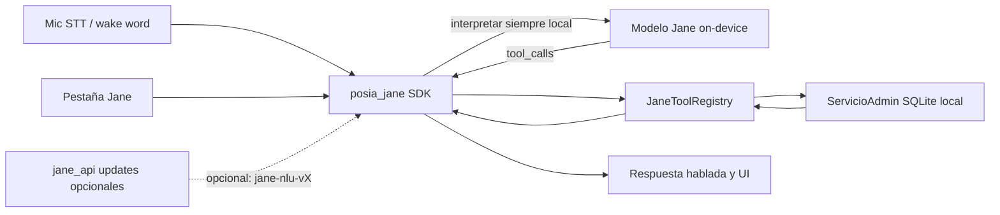

# Proyecto Jane — Asistente de voz centralizado

## Visión

Jane es el **punto fuerte de venta** de POSIA: un asistente de voz en español (MX) que entiende lenguaje natural, confirma acciones sensibles y ejecuta **todas** las operaciones del panel Admin (28 módulos + flujos anidados), además de absorber los comandos de caja ya existentes en `posia_voice`.

**Principio no negociable:** el cerebro de Jane es un **modelo propio**. No se usan APIs de LLM de terceros ni se envía audio/texto de negocio a NLU cloud. El modelo se entrena en la infra POSIA y en runtime **corre siempre en el dispositivo** (con o sin red).

Se entrega como:

1. **Módulo cliente reutilizable** (`packages/posia_jane`) — SDK + **runtime de inferencia on-device**.
2. **Microservicio** (`server/jane_api`) — **distribución** de artefactos `jane-nlu-vX` (y `/v1/interpret` opcional). **No es requisito** para interpretar en el POS.
3. **Pipeline ML** (`ml/jane/`) — dataset, entrenamiento, evaluación, empaquetado.
4. **Integración POS** — pestaña **Jane** + wake word **"Hey Jane"** + adaptadores a `ServicioAdmin`.



---

## Decisiones de arquitectura (cerradas)

| Decisión | Elección |
|----------|----------|
| Nombre del módulo | `packages/posia_jane` (nuevo). `posia_voice` se **migra/depreca** dentro de Jane (caja + alta producto). |
| Dónde corre el modelo | **Siempre on-device** (caja Windows/Android/iOS). Con red o sin red: NLU + tool planning + ejecución sobre SQLite local. |
| Red | **No requerida** para entender ni ejecutar comandos. Solo afecta sync de negocio (como el resto del POS) y **opcional** descarga de updates del modelo. |
| Microservicio `jane_api` | Registry/distribución de `jane-nlu-vX` (`GET /v1/models/...`). `POST /v1/interpret` opcional para otras apps o diagnóstico. **Fuera del camino crítico del POS.** |
| Cerebro NLU | Modelo Jane propio embebido/cuantizado. Salida = dominio + `tool_calls[]` + texto. **Prohibido** APIs de LLM de terceros. |
| Base del modelo | Checkpoint open-weight pequeño solo como peso inicial → artefacto POSIA `jane-nlu-vX`. Preferir **modelo ligero on-device** (dominio + slots / encoder ONNX) que quepa en CPU de caja típica. |
| Runtime de inferencia | ONNX Runtime (o equivalente) **en el proceso de la app** vía `posia_jane`/FFI. Artefacto en assets o datos de la app. |
| STT / TTS | Engines del OS en dispositivo; sin ASR/TTS cloud de terceros. |
| Sin modo degradado NLU | El mismo modelo on-device cubre caja **y** admin completo. No existe “admin solo con red”. |
| Ejecución de acciones | Siempre en dispositivo. `jane_api` nunca escribe en SQLite del POS. |
| Permisos | [`PoliticaAccesoAdmin`](packages/posia_core/lib/src/utils/politica_acceso_admin.dart) + [`PermisosAdmin`](packages/posia_core/lib/src/constants/permisos_admin.dart). Filtrar tools antes de inferir y antes de ejecutar. |
| Licencia | `ModuloLicencia.voiceCommands`. |
| Wake word | Detector **on-device** self-hosted para **"Hey Jane"** / **"Oye Jane"**. Fallback STT local por frase. |
| Confirmación | Mutaciones irreversibles o de dinero → confirmación obligatoria. |
| Idioma | ES-MX; tools `snake_case` inglés técnico. |
| Datos de entrenamiento | Dataset propietario en `ml/jane/datasets/`. Sin labeling/LLM cloud de terceros. |

---

## Inventario de capacidades (contrato funcional)

Jane debe cubrir **todas** las claves de [`catalogo_menu_admin.dart`](apps/posia_pos/lib/util/catalogo_menu_admin.dart) más flujos anidados y caja.

### Cuenta
`mi_cuenta`, `usuarios`, `asistencia`, `nomina`, `roles_personalizados`

### Ventas
`ventas`, `pedidos`, `historial` (devolver/anular/eliminar), `creditos`, `cotizaciones`, `corte`

### Catálogo
`categorias`, `productos` (+ variantes, presentaciones, mayoreo), `importar_productos`, `etiquetas`, `precios`

### Inventario
`existencias`, `compras`, `movimientos`, `traspasos`, `almacenes`, `presentaciones`

### Personas
`clientes` (+ descuentos/precios especiales), `proveedores`

### Reportes y sistema
`tiendas`, `reportes`, `sync`, `config`

### Caja (legado `posia_voice`)
`agregar_productos`, `cobrar`, `vaciar_carrito`, alta producto por voz

**Fuente de verdad de ejecución:** métodos públicos de [`ServicioAdmin`](packages/posia_database/lib/src/services/servicio_admin.dart) + [`ServicioAsistencia`](packages/posia_database/lib/src/services/servicio_asistencia.dart) + [`ServicioNomina`](packages/posia_database/lib/src/services/servicio_nomina.dart) + [`ServicioCorteCaja`](packages/posia_database/lib/src/services/servicio_corte_caja.dart).

---

## Estructura de carpetas objetivo

```
packages/posia_jane/                 # SDK + inferencia on-device
  lib/posia_jane.dart
  lib/src/
    contrato/          # JaneSession, JaneMessage, JaneTool, JaneToolCall, JaneToolResult
    registro/          # JaneToolRegistry, JanePermissionGate
    inferencia/        # JaneOnDeviceInterpreter (ONNX/FFI) — camino crítico
    cliente/           # JaneModelUpdateClient (HTTP opcional → jane_api)
    orquestador/       # JaneAssistant: turnos, confirmaciones, tool loop
    wake/              # abstracción WakeWordEngine
  assets/models/       # o descarga a app support: jane-nlu-vX.onnx
  test/

server/jane_api/
  bin/server.dart
  lib/src/
    enrutador_api.dart
    middleware_api_key.dart
    registro_modelos.dart    # GET /v1/models, servir artefactos
    interpret_opcional.dart  # POST /v1/interpret (no usado por POS en prod)
    esquemas_tools.dart
  models/                    # jane-nlu-vX.onnx + checksums
  Dockerfile
  docker-compose.yml

ml/jane/                     # pipeline ML (entrenar una vez; correr en caja siempre)
  datasets/
  schemas/
  training/
  eval/
  export/                    # ONNX + MODEL_CARD.md → embebido en app / jane_api

apps/posia_pos/lib/
  screens/pantalla_jane.dart         # pestaña Jane
  voz/
    servicio_voz_dispositivo.dart    # existente; extender
    servicio_wake_word_jane.dart     # nuevo
    adaptador_tools_posia.dart       # registra tools → ServicioAdmin
  providers/jane_providers.dart
```

El SDK **no** depende de `posia_database` ni Flutter. Cada app inyecta un `JaneToolRegistry` con handlers. Eso es lo que hace Jane reutilizable en otras apps.

---

## Contrato del SDK (para implementadores)

### Tipos mínimos
- `JaneTool`: `name`, `description`, `jsonSchema`, `requiredPermission` (nullable), `requiresConfirmation`, `handler(args) → JaneToolResult`
- `JaneSessionContext`: `tenantId`, `storeId`, `deviceId`, `userId`, `role`, `permisosAdmin[]`, `locale`
- `JaneTurn`: user utterance → **inferencia on-device** → tool calls → resultados → respuesta hablable

### API HTTP del microservicio (distribución; no camino crítico POS)

| Método | Ruta | Rol |
|--------|------|-----|
| GET | `/v1/health` | health (sin API key) |
| GET | `/v1/models` / `/v1/models/:version` | listar/descargar artefacto `jane-nlu-vX` |
| POST | `/v1/interpret` | opcional (otras apps / debug); POS usa motor local |

Auth: header `x-api-key` (env `JANE_API_KEY`).

**Importante:** el cliente filtra tools por permiso **antes** de inferir. La autorización dura ocurre al ejecutar el handler local.

### Loop de herramienta (cliente — siempre local)

1. STT o texto → `JaneAssistant.handleUtterance`
2. `JaneOnDeviceInterpreter.interpret` (modelo embebido; **sin red**)
3. Por cada `tool_call`: si `requiresConfirmation` → UI/voz confirma → `registry.execute` (SQLite local)
4. Si hace falta segunda ronda (slots faltantes / desambiguación): otra inferencia local (máx N rondas)
5. TTS + transcript en pestaña Jane
6. (Opcional, en background con red) comprobar updates de modelo vía `jane_api`

---

## Catálogo de tools (mapeo Admin → Jane)

Los subagentes deben generar un documento vivo `docs/JANE_TOOLS.md` y el código espejo en SDK + `jane_api`. Agrupar por dominio; cada tool = 1 operación atómica del servicio (no pantallas).

Ejemplos representativos (lista completa = cobertura 1:1 con métodos usados por las pantallas admin):

| Dominio | Tools (ejemplos) | Permiso | Confirmación |
|---------|------------------|---------|--------------|
| Productos | `list_products`, `get_product`, `register_product`, `update_product`, `deactivate_product`, `set_product_price`, `list_variants`, `register_variant` | `productos` | sí en delete/deactivate |
| Categorías | `list_categories`, `register_category`, `update_category`, `reorder_categories`, `delete_category` | `categorias` | sí en delete |
| Inventario | `get_stock`, `register_stock_movement`, `list_movements`, `set_min_stock` | `existencias` / `movimientos` | sí en ajustes negativos |
| Compras | `list_purchases`, `register_purchase` | `compras` | sí |
| Traspasos | `list_transfers`, `create_transfer`, `receive_transfer` | `traspasos` | sí |
| Almacenes | `list_warehouses`, `register_warehouse`, `adjust_warehouse_stock`, `transfer_warehouse_to_store` | `almacenes` | sí |
| Clientes | `list_clients`, `register_client`, `update_client`, `client_discounts_*`, `client_special_prices_*` | `clientes` | sí en delete |
| Proveedores | CRUD proveedor + vincular producto | `proveedores` | sí en delete |
| Ventas/historial | `sales_summary`, `sales_history`, `return_sale_lines`, `void_sale`, `delete_sale` | `ventas`/`historial` | sí en void/delete/return |
| Créditos | `list_pending_credits`, `register_credit_sale`, `liquidate_credit` | `creditos` | sí |
| Pedidos | `list_orders`, `register_order`, `assign_order`, `deliver_order`, `cancel_order` | `pedidos` | sí en cancel |
| Cotizaciones | CRUD cotización | `cotizaciones` | sí en delete |
| Corte | `open_cash_shift`, `close_cash_shift`, `list_recent_shifts` | `corte` | sí en close |
| Usuarios/roles | CRUD usuario, cambiar PIN, CRUD rol personalizado | `usuarios` / `roles_personalizados` | sí |
| Asistencia/nómina | check-in/out admin flows, tarifas, cerrar periodo, export | `asistencia` / `nomina` | sí en cerrar periodo |
| Tiendas/config/sync | CRUD tienda, config device/printer, sync manual/reconcile | `tiendas`/`config`/`sync` | sí en sync repair / delete tienda |
| Reportes | summaries por vendedor/producto/hora/pago + alertas stock | `reportes` | no |
| Caja | `add_cart_lines`, `checkout`, `clear_cart` | (caja / sesión) | cobrar: confirmación opcional según monto |

**Regla de cobertura:** un subagente no cierra la fase de tools hasta que cada pantalla en `apps/posia_pos/lib/screens/pantalla_*admin*.dart` (y satélites) tenga al menos un tool por mutación/consulta que hoy dispara la UI.

---

## Integración UI en POSIA

### Pestaña Jane
- Extender [`DestinoNavegacionInicio`](apps/posia_pos/lib/providers/admin_providers.dart): agregar `jane`.
- Visible si licencia `voiceCommands` y hay sesión.
- Pantalla: historial de conversación, estado (escuchando / pensando / confirmando / offline), botón mic, indicador wake word activo.
- No reemplaza Admin: Admin sigue para UI táctil; Jane es canal paralelo.

### Wake word
- Con pestaña Jane visible **o** con “escucha global” activada en config: motor wake word en background.
- Al detectar “Hey Jane”: beep/UI, abrir/enfocar pestaña Jane, STT de comando.
- En Windows priorizar fallback por frase en STT si el plugin wake word no soporta bien desktop.

### Adaptador POS
Archivo clave: `apps/posia_pos/lib/voz/adaptador_tools_posia.dart`
- Obtiene `ContenedorServicios` / `servicioAdminProvider`
- Registra handlers que llaman métodos existentes
- Aplica `PoliticaAccesoAdmin.puedeVerSeccionAdmin` y `_validarPermisoTienda` (vía servicios)
- Resuelve entidades ambiguas (producto/cliente por nombre) reutilizando `ResolvedorProductoVoz` migrado

### Migración de voz actual
- Mover lógica de [`packages/posia_voice`](packages/posia_voice) → `posia_jane/lib/src/offline/`
- Mantener barrel `posia_voice` como export deprecado 1 release, o reexport desde `posia_jane`
- Actualizar `pantalla_caja_movil` y `pantalla_formulario_producto` para usar Jane orchestrator (misma UX, backend unificado)

---

## Fases del proyecto (orden para subagentes)

### Fase 0 — Fundación (1 sprint)
**Objetivo:** esqueleto compilable con interfaz de inferencia local (stub).

- Crear `packages/posia_jane` (contratos, registry, `JaneOnDeviceInterpreter` stub).
- Crear `server/jane_api` con `/v1/health` + `/v1/models` mock.
- Crear `ml/jane/` con `MODEL_CARD.md` plantilla y schema de labels.
- Melos + path deps en `posia_pos`.
- Doc: `docs/JANE_ARQUITECTURA.md` + `docs/JANE_TOOLS.md`.
- **DoD:** app compila; orquestador llama interpreter local stub; sin dependencia de red en el turn.

### Fase 1 — Pestaña + pipeline de voz (1 sprint)
**Objetivo:** “Hey Jane” + conversación visible.

- `DestinoNavegacionInicio.jane` + `PantallaJane`.
- Wire STT existente + wake word abstracción + TTS (flutter_tts o plataforma).
- Orquestador: turno texto → interpret (mock) → respuesta.
- Providers Riverpod `jane_providers.dart`.
- **DoD:** usuario dice “Hey Jane” / toca mic, ve transcript y respuesta en la pestaña.

### Fase 2 — Tools Admin (core CRUD) (2 sprints)
**Objetivo:** cobertura Catálogo + Personas + consultas Inventario/Ventas.

- Implementar tools y handlers para: productos, categorías, clientes, proveedores, existencias, resúmenes de ventas, listas precios (lectura/escritura básica).
- Permission gate end-to-end.
- Confirmación UI para deletes.
- Tests: cada tool con fixture de args → llama servicio mockeado / integration smoke.
- **DoD:** checklist `docs/JANE_TOOLS.md` marcado para dominios Catálogo + Personas + ventas resumen.

### Fase 3 — Tools Admin (operaciones complejas) (2 sprints)
**Objetivo:** compras, movimientos, traspasos, almacenes, pedidos, créditos, cotizaciones, historial (devoluciones/anulaciones), corte, usuarios, roles, asistencia, nómina, tiendas, config, sync, reportes, importación, etiquetas.

- Handlers 1:1 con flujos de pantallas.
- Resolución multi-slot (ej. “traspasa 10 cajas de X de tienda A a B”).
- Desambiguación hablada: “¿Te refieres a Coca 600ml o 2L?”
- **DoD:** 100% claves `PermisosAdmin` tienen al menos los tools de la pantalla correspondiente; mutaciones sensibles confirman.

### Fase 4 — Modelo Jane propio on-device (2–3 sprints)
**Objetivo:** NLU de producción embebido en la caja; funciona sin red.

**4a — Datos** (igual: dataset propietario, splits, sin APIs cloud)

**4b — Entrenamiento**
- Pipeline `ml/jane/training/`; export **ONNX (u otro formato on-device)** + checksum + `jane-nlu-vX`.
- Presupuesto de tamaño/latencia documentado en `MODEL_CARD.md` (p.ej. bajo X MB y bajo Y ms en CPU de caja de referencia).
- Criterio: tool-correct ≥ 85% holdout; slot-F1 por dominio.

**4c — Inferencia on-device + distribución**
- `JaneOnDeviceInterpreter` carga el artefacto embebido; router 2 etapas en dispositivo.
- Empaquetar modelo en build de `posia_pos` (o first-run copy a app support).
- `jane_api` publica el mismo artefacto para updates opcionales.
- **DoD:** apagar red → Jane interpreta y ejecuta admin/caja sobre SQLite local; eval holdout pasa umbral.

### Fase 5 — Unificación caja + calidad (1 sprint)
**Objetivo:** producto vendible offline-first.

- Migrar `posia_voice` al orquestador Jane (mismo interpreter on-device).
- Suite regresión NLU + golden transcripts.
- Actualizar manuals.
- **DoD:** sin red: caja + admin por voz; con red: sync de datos y updates de modelo opcionales; permisos verificados.

### Fase 6 — Empaquetado reutilizable (0.5–1 sprint)
**Objetivo:** “cualquier otra app”.

- README: dependencia → registry tools → cargar `jane-nlu-vX` → wake/STT → UI.
- Ejemplo mínimo con 2 tools y modelo stub.
- `jane_api` como canal de distribución de modelos; changelog de versiones NLU.

---

## Paquetes de trabajo para subagentes (tickets)

Usar estos IDs al despachar subagentes:

| ID | Título | Depende de | Entregables |
|----|--------|------------|-------------|
| JANE-01 | Scaffold `posia_jane` + contratos | — | package + tests registry |
| JANE-02 | Scaffold `jane_api` distribución modelos | — | health + `/v1/models` + Docker |
| JANE-03 | Pestaña Jane + nav | JANE-01 | `pantalla_jane`, destino nav, providers |
| JANE-04 | Wake word self-hosted + STT/TTS dispositivo | JANE-03 | `servicio_wake_word_jane`, integración mic |
| JANE-05 | Catálogo tools + doc JANE_TOOLS | JANE-01 | schema completo documentado |
| JANE-06 | Adaptador POS tools (catálogo/personas) | JANE-05 | handlers reales |
| JANE-07 | Adaptador POS tools (inventario/ventas ops) | JANE-05 | handlers reales |
| JANE-08 | Adaptador POS tools (HR/sistema/reportes) | JANE-05 | handlers reales |
| JANE-09 | Permission gate + confirmaciones | JANE-06 | tests política acceso |
| JANE-10a | Dataset propietario utterances→tools | JANE-05 | `ml/jane/datasets` + splits |
| JANE-10b | Entrenamiento / export ONNX on-device | JANE-10a | `jane-nlu-vX` + MODEL_CARD (presupuesto CPU) |
| JANE-10 | Inferencia on-device en `posia_jane` | JANE-01, JANE-10b | `JaneOnDeviceInterpreter` + router 2 etapas |
| JANE-11 | Migrar `posia_voice` → Jane unificado | JANE-10 | caja/formulario usan mismo motor |
| JANE-12 | Eval holdout + runner métricas | JANE-10 | informe accuracy/slot-F1 |
| JANE-13 | Docs + guía reuso + canal updates modelo | JANE-10, JANE-02 | manuals + README |

**Regla para subagentes:** no inventar APIs de dominio nuevas; reutilizar `ServicioAdmin` / compañeros. Si falta un método atómico, proponer extensión mínima en `posia_database` y documentarla en el PR.

---

## Seguridad y cumplimiento

- **Prohibido en runtime:** llamadas a OpenAI, Gemini, Anthropic, Groq, o cualquier API de LLM/NLU de terceros; no existen `OPENAI_API_KEY` ni equivalentes en el despliegue.
- Artefacto del modelo en disco local de la caja; updates opcionales firmados/checksum desde `jane_api`.
- Texto de negocio **no sale** del dispositivo hacia NLU remoto (no hay NLU remoto en el camino crítico).
- No pasar catálogo completo al modelo: tools filtrados + top matches locales.
- Dataset/logs: sin PII sin anonimizar; retención en `MODEL_CARD.md`.
- Auditoría local de tools ejecutados.
- Jane no eleva privilegios.

---

## Criterios de aceptación globales (producto)

1. Existe pestaña **Jane** en la barra inferior.
2. “Hey Jane” (o “Oye Jane”) activa escucha de comando.
3. Jane ejecuta operaciones de **todas** las secciones Admin listadas, respetando rol/permisos.
4. Mutaciones sensibles piden confirmación explícita.
5. **Sin red:** Jane interpreta y ejecuta caja + admin sobre datos locales (mismo comportamiento que con red, salvo sync/hub y update de modelo).
6. `posia_jane` (modelo embebido) se reusa en otra app registrando tools propios.
7. Licencia `voiceCommands` apaga Jane por completo.
8. Ningún request de interpret en el POS depende de red ni de proveedor LLM externo.

---

## Riesgos y mitigaciones

| Riesgo | Mitigación |
|--------|------------|
| Ambigüedad de catálogo (nombres parecidos) | Resolver local → top-K → Jane pregunta |
| Windows wake word frágil | Fallback STT por frase; botón mic siempre disponible |
| Explosion de tools (~100+) | Router de 2 etapas: `select_domain` → 10–25 tools del dominio |
| Datos insuficientes para el modelo propio | Empezar por tools de alta frecuencia; slot-filling + reglas en cola larga; reentrenar por versiones |
| Coste CPU / latencia on-device | Modelo pequeño cuantizado ONNX; presupuesto en MODEL_CARD; router 2 etapas |
| Tamaño del APK/instalador | Modelo en assets o descarga first-run firmada; no bloquear install si update es opcional |
| Drift del modelo vs nuevos tools | Dataset + bump `jane-nlu-vX` antes de producción; update OTA opcional |
| ServicioAdmin monolítico | No refactorizar en Fase 0–3; solo adapters |
| STT del OS sin red | Validar engines offline por plataforma; documentar limitaciones del OS (no del modelo Jane) |

**Router de 2 etapas (obligatorio desde Fase 4):** primero `select_domain`, luego interpret con tools del dominio.

---

## Fuera de alcance (esta versión)

- Sustituir pantallas Admin táctiles.
- Ejecutar mutaciones en el servidor `jane_api`.
- ASR/TTS cloud de terceros; entrenamiento de ASR propio (STT del OS basta).
- Uso de APIs de LLM de terceros aunque sea “solo para bootstrap” o labeling.
- Soporte multi-idioma más allá de ES-MX.
